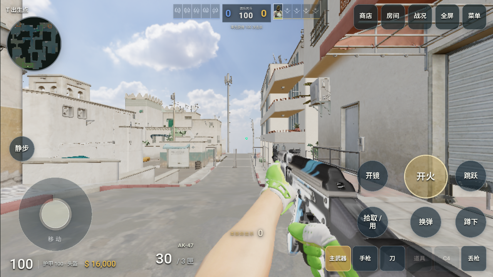

# 安卓全屏客户端

[下载 Dust II Android 1.0.0](https://cs2.duskrain.cn/downloads/DustII-Android-1.0.0.apk) · [打开网页版](https://cs2.duskrain.cn/)

下载并安装 APK，从桌面的「尘雨 Dust II」图标打开。客户端横屏运行，不显示浏览器地址栏，默认隐藏状态栏和导航栏；从屏幕边缘滑动仍可以临时唤出系统导航，这是 Android 保留的退出方式。



*安卓模拟器实拍，最低画质、亮度 112%，未编辑图像；左侧摇杆，右侧瞄准与战斗按钮。首次打开时，Android 可能显示全屏手势说明，点「知道了 / Got it」后继续。*

客户端连接现有联机大厅，保留手机摇杆、滑动瞄准和战斗按钮。第一次进入仍需下载地图、探员和声音，额外武器、皮肤、音乐按需加载。安装包约 0.9 MB，不包含全部游戏资源，也不包含离线对局服务器。

## 使用与保存

- 需要 Android 8.0 或更高、支持 WebGL2 的设备，以及 Chromium 110 或更高的 Android System WebView。网页组件过旧会显示更新提示。
- 设置与资源保存在客户端自己的应用数据中，后续启动复用缓存。浏览器与客户端的数据各自独立；已有设置可通过「本地资源 → 导出设置备份 / 恢复设置备份」迁移。
- 同签名覆盖安装保留应用数据；卸载、清除应用数据或系统回收缓存会使本地资源丢失。多人对战始终需要网络。
- 切到后台或拉出系统窗口会松开游戏输入。返回键先显示退出确认，避免误触直接离开对局。
- WebView 渲染进程退出时显示重新进入界面；此恢复机制不能保证阻止 Android 因内存紧张终止整个应用。默认最低画质仍建议保留。

网页版也增加了「网页全屏」「下载安卓 APK」「添加到主屏幕」入口。手机点击开始或返回游戏时默认请求全屏，可以在设置的「触屏」页关闭。全屏请求放在点击手势中，不能绕过浏览器权限或永久禁止用户退出。

## 构建

当前构建使用 JDK 21、Gradle 8.11.1、Android Gradle Plugin 8.9.2、Android SDK 35 / Build Tools 35.0.0。设置 `DUSTII_ANDROID_TOOLS` 指向包含 `sdk`、`gradle-8.11.1`、`gradle-home` 的工具目录；本机已有工具默认位于 `H:\playfround\.android-build-tools`。

```powershell
# 第一次构建，仅创建一次自己的发布签名。
./scripts/build-android.ps1 -InitializeSigning
# 缓存齐全时，之后可以离线构建。
./scripts/build-android.ps1 -Offline
npm.cmd run build
```

脚本同时构建 debug/release，执行 Android Lint 并验证 APK 签名。发布产物为 `public/downloads/DustII-Android-1.0.0.apk`，校验信息位于同目录 `android-latest.json`，两者由 Vite 复制到 `dist/downloads`。

`android/signing` 是本项目的私有签名目录，已加入 Git 忽略；应单独私下备份，后续升级沿用同一个签名。发布包和仓库不包含私钥或密码。版本升级时同步修改 Gradle、构建脚本和网页下载链接中的版本号。

Release 只加载 `https://cs2.duskrain.cn/`。原生设置导出桥只接受该来源的主页面消息；不接受任意网站的原生调用，不绕过 TLS 校验。Debug 支持通过 `qaUrl` Intent extra 指向 `http://127.0.0.1:端口/`，用于 `adb reverse` 本地验收，发布版忽略该参数。

## 验证范围

浏览器验证覆盖真实触摸手势请求全屏、进入游戏自动全屏、游戏内全屏按钮、触屏控制激活和 APK 下载文件格式。单元测试覆盖权限拒绝、不支持、方向锁定失败和原生宿主分支。

2026-09-13 验收：244 项游戏测试、7 项客户端发布校验测试通过；Android Lint 为 0 错误。Android 15 / WebView 124 模拟器通过实际 WebGL 对局、横屏触控、后台返回、设置缓存、文件选择器和返回键确认检查。Android 11 / WebView 83 验证了过旧组件提示。

发布签名包已安装并打开公网大厅。在本地模拟器中主动终止其渲染进程后，原生进程保持存活，出现重试界面，重新进入后设置仍保留。模拟器是 `userdebug` 系统，会强制开放 WebView 调试；发布 APK 的应用清单没有 debuggable 标志，代码使用 `BuildConfig.DEBUG=false`。

客户端已热更新到网站，服务器进程没有重启；网页 HTML、JS、CSS、manifest 和公网 APK 均与本地构建哈希一致。详细数据见 [ANDROID-ACCEPTANCE.json](ANDROID-ACCEPTANCE.json)。模拟器验证不代表所有品牌手机的帧率或发热表现；当前没有已连接的安卓真机。

版本 1.0.0：903,105 字节；APK SHA-256：`e90cda7f9e36b73f86f0366a73b74ac1d611c4d78c61686eecb40c87b8d838c8`。

实现依据：[Android 沉浸模式](https://developer.android.com/develop/ui/views/layout/immersive)、[WebView 宿主](https://developer.android.com/develop/ui/views/layout/webapps/webview)、[WebView 进程恢复](https://developer.android.com/develop/ui/views/layout/webapps/managing-webview)、[浏览器全屏与用户手势](https://developer.mozilla.org/en-US/docs/Web/API/Element/requestFullscreen)。
