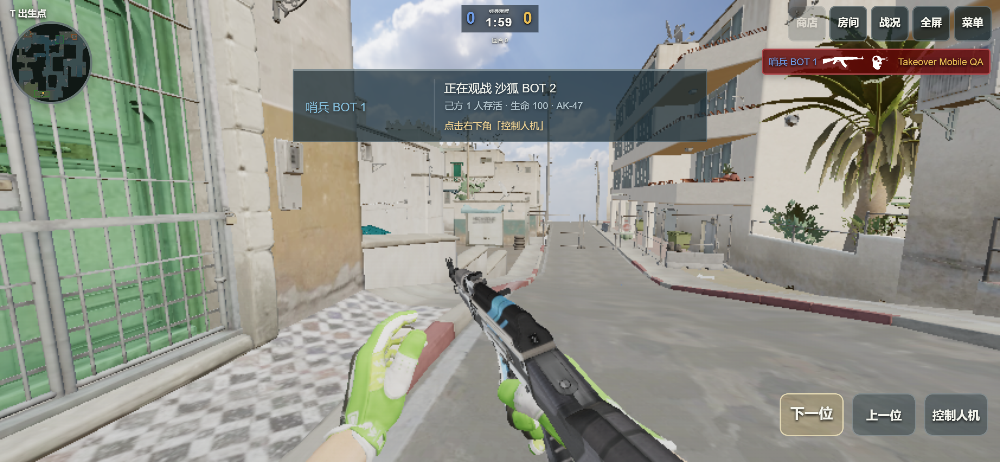
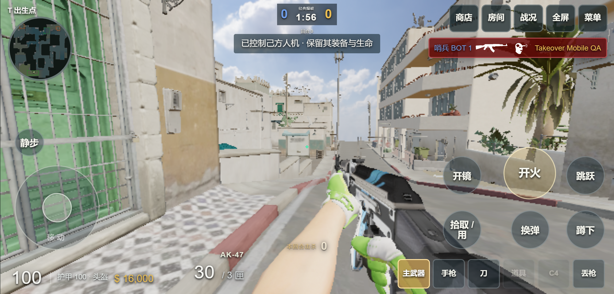
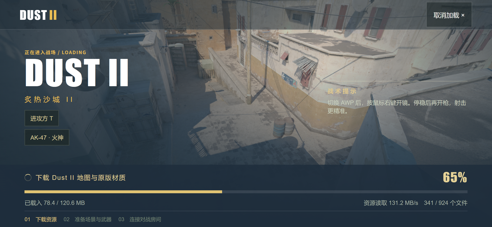

# 阵亡接管人机、手机加载与联机带宽更新

爆破模式阵亡后，先观看短暂死亡视角，再用鼠标左右键切换存活队友。观战己方人机时，按 **E** 接管；自定义过「使用」按键的玩家使用自己的绑定。手机点右下角「控制人机」。已经由另一位玩家控制的人机不可抢占。

接管保留人机的位置、生命、护甲、拆弹器、武器、弹药、换弹进度和冷却。服务器把这具身体的移动、射击、切枪、购买与丢枪交给控制者，取消交接前遗留的开火和投掷输入；不会新增角色或复制手雷。击杀记入控制者的战绩。下一回合恢复自己的角色，断线则让存活人机恢复 AI。房主身份、席位和个人外观设置继续归属于原来的玩家。

## 手机界面

画面按手机实际可见宽高投影，监听地址栏变化与横竖屏切换；电脑仍保留 16:9、4:3 和拉伸选项。手机缩小雷达、比分、击杀信息、摇杆和战斗按钮。死亡信息移到顶部，观战期间隐藏移动、换弹和武器栏，只保留有用的观战控制。已检查 844×390、667×320、390×844，按钮没有越出屏幕。

## 修复材质准备阶段的内存压力

截图中的「924/924 下载完成、材质 510/514」属于下载之后的准备阶段。原地图 510 张纹理按宽×高×4 估算的 RGBA 数据为 937.7 MiB，手机档为 105.5 MiB；这是纹理数据估算，不是进程实际内存，也不包含 mipmap、显存副本、几何、声音和人物。

手机档从相同原版纹理生成，最大边长 256，保留几何、材质关联、UV 和透明通道；手机的武器及人物纹理在解码时限制到最大边长 512。地图、探员、手臂与武器共用四个解码任务名额。读取或解码失败会显示重试，不再把缺失材质默默当作成功；解码与着色器准备设有超时。

| 首次基础下载 | 体积 |
| --- | ---: |
| 桌面资源档 | 201.3 MiB |
| 手机资源档 | 120.6 MiB |

浏览器分别保存两个清单，按 SHA 复用相同资源。已有缓存不会被清空。可选武器、探员和音乐盒继续按需下载。

生成手机纹理：`python scripts/build-mobile-map.py`（需要 Pillow）。运行 `npm run build` 生成两个下载清单；锁文件同时包含两档资源，干净 clone 可通过原有 `npm run assets:fetch` 恢复。

纹理解码和显式资源回收参考 [Three.js GLTFLoader](https://threejs.org/docs/pages/GLTFLoader.html) 与 [资源释放说明](https://threejs.org/manual/en/how-to-dispose-of-objects.html)；可见尺寸监听参考 [MDN VisualViewport](https://developer.mozilla.org/en-US/docs/Web/API/VisualViewport)。

## 5 Mbps 带宽测量

此前公网十个角色的房间每位真人接收约 1.56–1.61 Mbps 的未压缩同步数据，三人就接近 5 Mbps，还没有计入资源下载。当前开启 WebSocket 协商压缩，保留 15 Hz 快照和原来的游戏协议；不支持压缩的连接继续正常使用。压缩任务并发受限，不保留跨消息压缩上下文。

2026-09-13 新版公网独立测试房间，每阶段约 8 秒。下表是实测，不是套餐容量承诺。10 个角色始终在房间内，随着真人连接加入逐个替换人机。

| 测试连接数 | 人机数 | 全部测试连接接收流量 | RTT 中位数范围 | 最大的单连接 RTT P95 |
| ---: | ---: | ---: | ---: | ---: |
| 1 | 9 | 0.218 Mbps | 39 ms | 44 ms |
| 2 | 8 | 0.504 Mbps | 38 ms | 40 ms |
| 5 | 5 | 1.215 Mbps | 38–39 ms | 299 ms |
| 10 | 0 | 2.140 Mbps | 38–39 ms | 44 ms |

五人阶段两条连接出现短暂延迟尖峰，不能声称网络始终稳定。十人阶段每条连接每秒接收 15 张快照，无协议错误；测试结束关闭全部测试连接。服务器统计窗口内 tick P95 最高约 6.22 ms，预算为 33.33 ms；曾出现一次约 94 ms 的长 tick。当前证据没有显示持续 CPU 或内存不足。

测试连接来自同一台电脑，没有模拟十位玩家同时射击、移动、下载素材或不同运营商线路。初次下载仍可能占满 5 Mbps；若持续出现「有人下载，其他人高延迟」，应优先增加出口带宽或为静态素材使用独立分发服务，再考虑 CPU 升级。可用 `node scripts/measure-network.mjs --url https://cs2.duskrain.cn --clients 10` 复测；脚本只创建一个独立房间，结束后自动清理自己的连接。

## 验证与发布

- 254 项 Node 测试通过；最后的手机界面变更另通过 13 项相关测试。
- 浏览器真实加载手机档、阵亡观战、触屏接管、三种尺寸通过；桌面按 E 接管后移动、切枪与开火通过。
- 解码并发限制、损坏纹理失败重试、旧版无压缩连接及压缩数据一致性均有自动测试。
- 发布包边界与回滚相关 17 项测试通过；线上 1,610 个资源、服务器及共享代码文件 SHA 核对一致，公网 HTML、JS、CSS、手机清单及 APK 字节一致。
- 发布版本 `20260913T061345Z`，切换前无在线玩家；安卓 APK 使用相同网页更新，无需重新安装。

手机浏览器测试使用桌面 Chrome 的触屏设备模拟，并非用户这台安卓真机。真机上的解码速度、驱动行为和长时间稳定性仍需实测。
