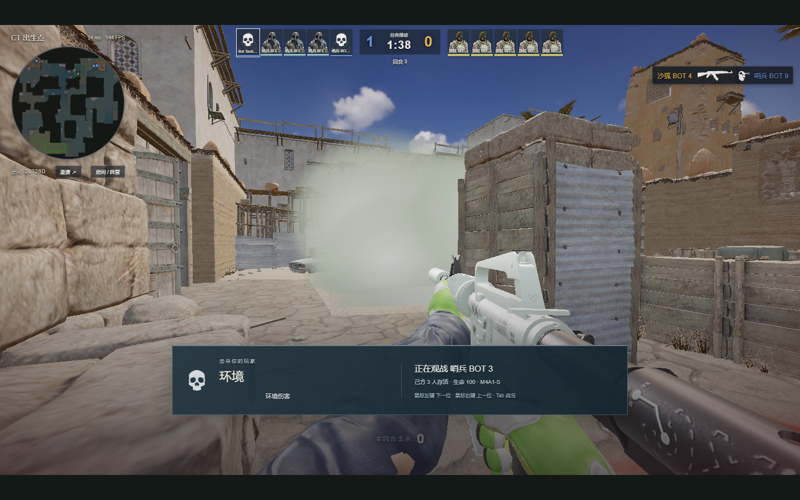

# 人机感知、瞄准与投掷重做

2026-09-13。修复掩体边缘瞄准错误、道具打断交火、没有瞄准到位就松手的问题。本次重做保留当时的反应时间、转向速度和射击误差。后续的协作与小幅枪法调整见[追加更新](MOBILE-BOT-BALANCE.md)。

## 对局中的变化

- 开火时检查真正瞄准的胸部、头部或下身采样点；一个部位被挡住就检查其他部位，全部被墙或烟挡住则停止开火。新目标需要进入视野。附近敌方枪声只提供短暂、近似的转向提示，不提供隔墙目标锁定。
- 行走方向与观察方向分开：沿路线移动时看前方可见区域，到点后轮流守关键角度，保持短暂停留，减少扫视。队友看到的信息用于支援；不会直接读取全图敌人位置来追踪。
- T 在进点前短暂集结，先手、补枪位置和持包者错开进入。等待有超时，队友死亡或走远不会让人机一直等。下包后分散守点，CT 保留一人拆包、其他人掩护的分工。
- 道具使用独立的接近站位、站稳、预演、瞄准、准备、释放流程。交火、受伤、致盲或执行炸弹操作时中断投掷；取消不消耗库存。扔完切回可用枪械。
- 每次实投前，复用玩家使用的碰撞、反弹、引信和燃烧传播逻辑计算结果，再检查目标区域、角度、脚下速度和队友。轨迹不好、站位漂移或会影响近处队友时放弃。

## 已校准范围

当前发布 9 个候选投点：中路掩护烟、A 大封 CT 烟、B 门烟、B 洞出点闪、A 车火、CT 封 B 洞烟、CT 封 A 小烟、B 后点火和 B 后点高爆。

每个候选均通过实际地图碰撞测试，以及水平站位 ±0.1 米、水平角 ±0.002 弧度的扰动检查。烟检查目标附近落点与一条原本无遮挡的参考视线；燃烧检查目标处实际生成的火焰单元；闪光和高爆检查爆点与目标之间的可见性。这是空间有效性检查，不等同于实战一定致盲、造成伤害或赢下进点。

B 窗口烟未通过这一轮校验，未进入发布投点表。中路采用本项目可用的掩护烟，没有声称复刻 CS2 原生 Xbox 投法。闪光、高爆和燃烧还受队友位置、敌情与库存限制；没有安全机会时保留道具。当前没有完整的队友转头避闪、职业队同步爆弹或学习型战术。

## 性能与验证

实时预演每个房间每帧最多推进 4 个模拟步，复用 30 Hz 服务器与内部碰撞子步。离线校准脚本的参数搜索不在对局中运行。任务、认领和协同状态按回合重置，死亡和离开释放尚未完成的投点认领。

- 227 项自动测试通过，包含部分身体露出、烟墙遮挡、背后目标、枪声过期、观察角保持、180° 转身不提前松手、交火/受伤取消、预演预算和无人到场时集结超时。
- 三组不同随机种子，各 240 秒，9 名机器人与 1 名静止测试玩家：共 44 次释放，记录到 42 次完成生效；这 42 次均通过上述区域判定。其余 2 次未在记录窗口内获得生效结果，不计为成功。
- 本机服务器 tick P95 为 2.30 / 2.87 / 2.75 ms，峰值 24.81 ms；单帧预算为 33.33 ms。这是当前机器的单房间模拟结果，不能外推为公网多房间容量或所有玩家电脑的帧率。
- 实际 Chrome 加载地图后观察 9 名机器人，确认自动投烟、切回步枪、死亡观战持续运行；无页面错误或 WebGL 上下文丢失。截图和数据来自受控本地 QA。



可复现入口：

```sh
npm test
node scripts/calibrate-bot-lineups.mjs
node scripts/qa-bot-rework.mjs
npm run build
```

证据见 [本次验证记录](validation/bot-rework-20260913.json)。预演与人机逻辑运行在服务器，网页版更新后由服务器使用新逻辑；离线便携包包含独立服务器，需要新版包。

## 参考资料

- [CS2Nades 自制 Dust2 道具演示](https://cs2nades.gg/en/guides/best-dust2-nades-in-cs2)：参考中路、CT 通路、B 门与出点闪的战术用途；站位和投掷参数重新针对本项目物理校准，没有照搬 Source 2 控制台角度。
- [v1dma 的 Dust2 中路控制课程](https://cs2pulse.com/how-to-take-mid-control-on-dust-2-as-t/)：参考控制信息、分路与队友衔接。
- [CS2-Bot-Improver 作者仓库](https://github.com/ed0ard/CS2-Bot-Improver)：参考按情境选择行为和改善瞄准的方向。它是原生 CS2 插件，本项目未直接加载该插件，也未复制其实现。

本次为本项目的规则式机器人改进，不是 Valve 官方机器人代码移植。

## 发布验收

已发布到 [cs2.duskrain.cn](https://cs2.duskrain.cn/)，版本 `20260913T024304Z`，功能提交 `2e37d44028bd3a312221bdb7ada8c08aefb16d38`。六个相关服务器模块的线上字节与本地测试源码一致；原版本保留用于回退。新增道具取消、三档投掷、开镜输入、掉枪和 5 对 5 席位的 14 项公网检查通过。

随后使用普通公网协议建立 9 人机房间，连续运行 70 秒，接收 1056 次状态更新，没有断线。最后一个 60 秒采样窗口 tick P95 为 6.53 ms，观测中的最高 P95 为 7.16 ms；整个检查期间最高单次 tick 为 63.11 ms，包含启动阶段的窗口，不能称为完全无尖峰。目前未见持续超过 33.33 ms 帧预算的服务器负载，不据此要求升级服务器。这个短测不代表多房间容量测试，也没有复现或排除所有浏览器退出原因。

新版便携包 `DustII-Windows-x64-20260913-024305.zip`：369,616,671 字节，SHA-256 `3f4bb1e7f937a631012bfac16ffa01cab00c5aff95dff7a06020c30a8b76e638`。ZIP CRC、2440 个文件的大小与 SHA-256 均通过。来自上述干净功能提交，包含 1057 个锁定资源。

实际浏览器验证：离线入口屏蔽外网 HTTP 资源请求后运行 9 名人机；在线入口从本机读取资源并连接 `wss://cs2.duskrain.cn/ws` 的新版本，运行 3 名人机。两者均没有页面错误或 WebGL 上下文丢失。公网和离线使用的是同一批人机源码。
