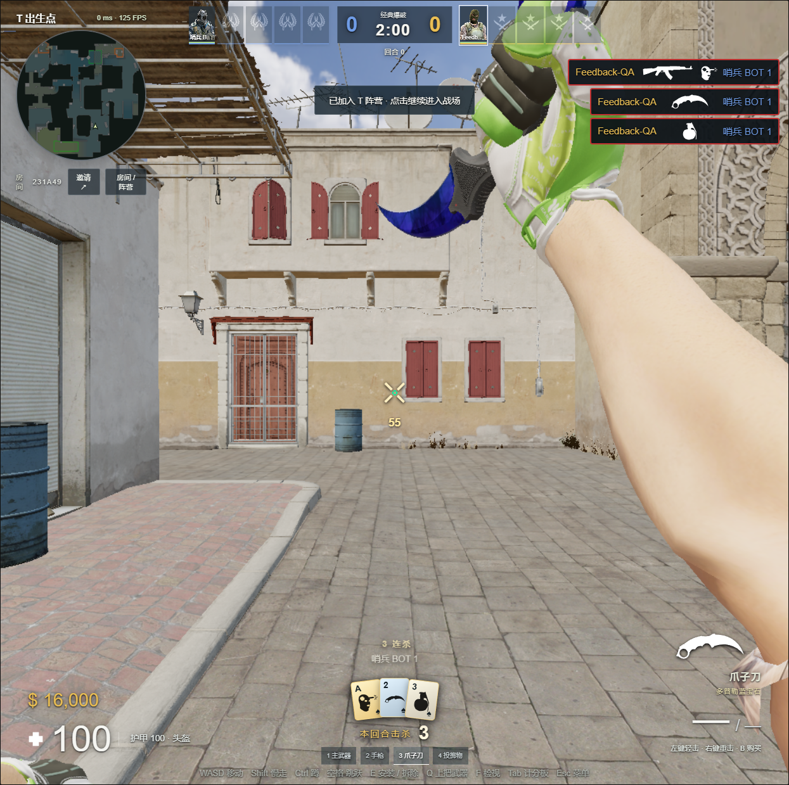
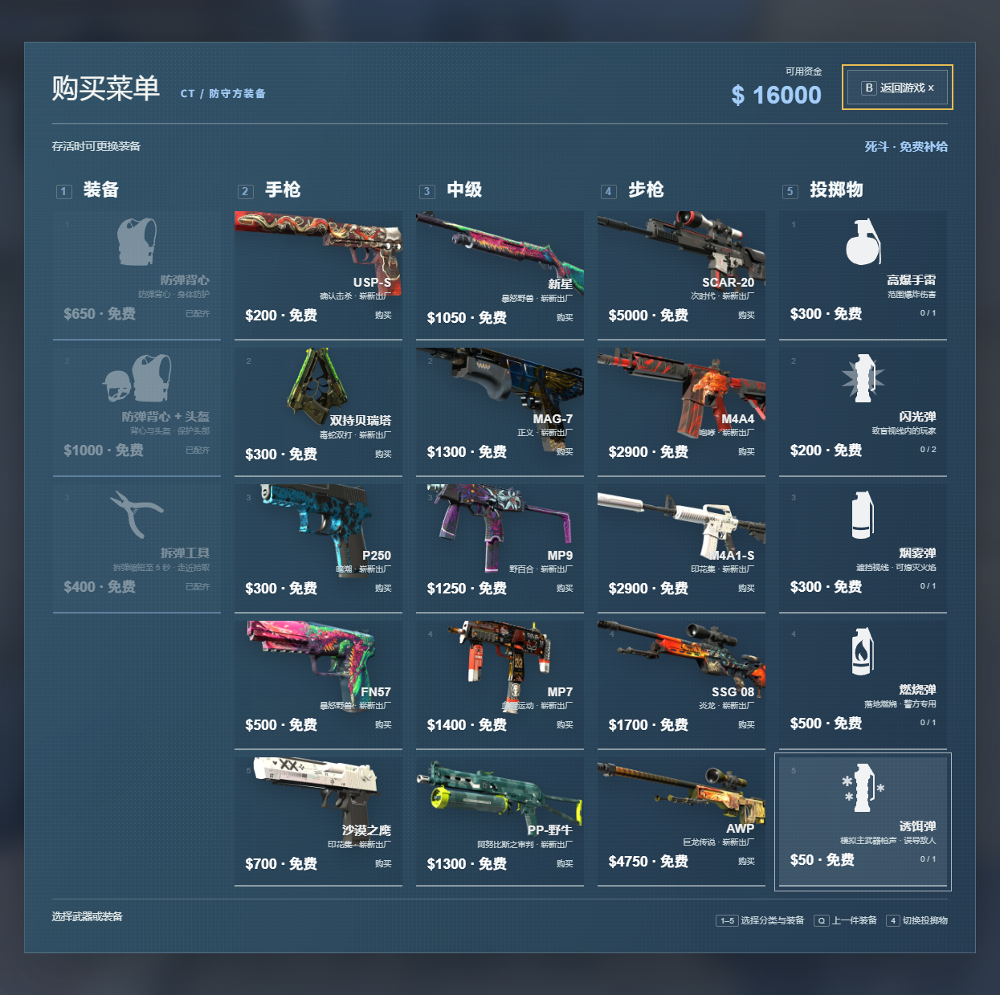
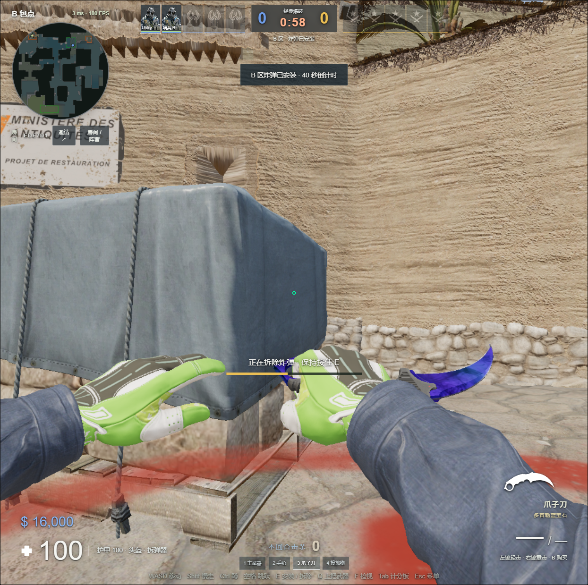

# 战斗反馈、台阶与五类道具

本次更新让击杀结果、近战和投掷操作更清楚，并修复 A 小台阶与下包、拆包时的位置问题。

## 回合击杀卡

屏幕下方保留本回合击杀总数，前五次击杀以扇形扑克牌呈现。爆头、刀杀和道具击杀使用不同的原版图标。爆破死亡后保留，到下一回合清零；死斗统计当前一条命。服务器快照携带数字和卡片，漏收事件不会丢失结果，第六杀以后仍显示真实总数。

## 走路、切枪与刀

A 小台阶的问题来自旧的重叠探测：台阶立面先把碰撞箱推开，随后漏掉脚下可站立的踏面。现在以连续向下扫掠寻找最先接触的支撑面。步高上限仍为 0.46 米，过高障碍和低头顶空间仍不能直接穿过。

135 组不同步高、踏面宽度、旋转角度和侧边位置的楼梯用例，旧实现均出现停滞，新实现全部通过。真实 Dust2 的 A 小台阶测试覆盖中间和边缘四条可通行路线。原有跳跃、空中蹲跳、边缘落地和网络预测测试同时保留。

切枪播放从本机 CS2 只读提取的原版装备声音。刀改用近距离扫掠体积，轻击有侧向容错；右键是较短、较慢但伤害更高的重击。仍受距离、前方方向、墙体、护甲和一次只命中一人的限制。背刺按照目标朝向计算。

## 五类道具

| 类别 | T | CT | 目录价格 |
| --- | --- | --- | --- |
| 高爆 | 高爆手雷 | 高爆手雷 | $300 |
| 闪光 | 闪光弹 | 闪光弹 | $200 |
| 烟雾 | 烟雾弹 | 烟雾弹 | $300 |
| 燃烧 | 燃烧瓶 | 燃烧弹 | $400 / $500 |
| 诱饵 | 诱饵弹 | 诱饵弹 | $50 |

每方购买菜单有五个道具选项，最多携带四枚，闪光可带两枚。价格来自已安装 CS2 的 `scripts/weapons.vdata_c`，与网页实现的平衡参数区分记录。

按住左键、右键或双键准备，分别远投、低抛和中投；松开后出手，持握不提前消耗引信。切换装备和失焦取消准备。出手后保留 WASD 状态，修复持续按 W 却突然停走。弹道继承跑动和跳跃速度，按真实表面法线反射；客户端在快照之间有界插值，避免逐帧累加外推造成轨迹漂移。

高爆与闪光到时引爆；烟雾和诱饵落稳后生效。火焰仅生成在有地面支撑且未被墙隔开的区域，持续伤害、到时熄灭，烟雾可以灭火。诱饵在落地后间歇模拟投掷者主武器枪声，结束时有小范围爆炸。投掷物、烟雾、火焰、诱饵和音频实例均设置数量上限，换回合清理。

模型、手臂动作和切换声音来自原版游戏。诱饵使用与闪光同族的手臂动作。火焰、烟雾及近战是本项目的浏览器实现，不声称移植了 Source 2 的模拟内核或所有细节。

## C4 与拆弹器

持 C4 按住左键，或在下包点按住 E 安装；CT 在包旁按住 E 拆除。开始后自动蹲下、停止位移，位置锁定同时应用于服务器移动队列和客户端预测。视角可以自由上下、左右转动，镜头维持蹲姿高度；WASD 与跳跃不打断进度，松开操作键取消。死亡、离开有效状态或回合结束仍会中止。

拆弹器 $400，仅 CT 可购买；拆除耗时从 10 秒变为 5 秒。持有者死亡会掉落原版模型，其他存活 CT 走近可自动拾取，T 不能拾取。

## 依据与验证

- 原版视觉与声音：只读导出用户已安装的 Counter-Strike 2 VPK，保留来源路径和哈希。资源锁清单收录本次新增模型、动画、SVG 和音效。
- [Valve CS2 展示页](https://www.counter-strike.net/cs2/)：HUD 与道具视觉参考。
- [Valve 公开近战实现](https://github.com/ValveSoftware/halflife/blob/master/dlls/crowbar.cpp)：射线未命中时补充体积检测的参考；本项目不是这段引擎代码的直接移植。
- 207 项自动测试通过，包含真实 WebSocket 装备同步、135 组台阶、真实地图路线、近战遮挡/护甲/冷却、火焰与烟雾、拆弹器拾取、固定蹲姿与移动预测重放。

浏览器截图及数值见 `validation/feedback-20260911.json`。截图为本地真实渲染，未编辑；击杀卡用受控 QA 对局产生，测试控制接口仅监听本机且不打包部署。

发布版本 `20260911T034210Z` 已部署至 cs2.duskrain.cn，保留旧版本和配置备份。公网 21 项联机检查、11 个入口/新增资源的内容哈希核对通过。便携 ZIP 的 CRC 与解压后 2401 个文件的哈希全部通过；实际离线运行三个人机，无外网资源请求，在线入口成功使用本机资源连接公网房间。
