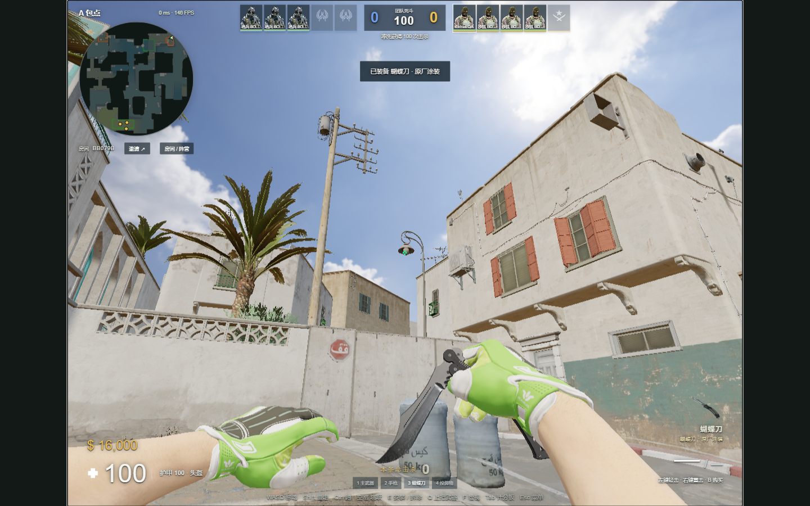
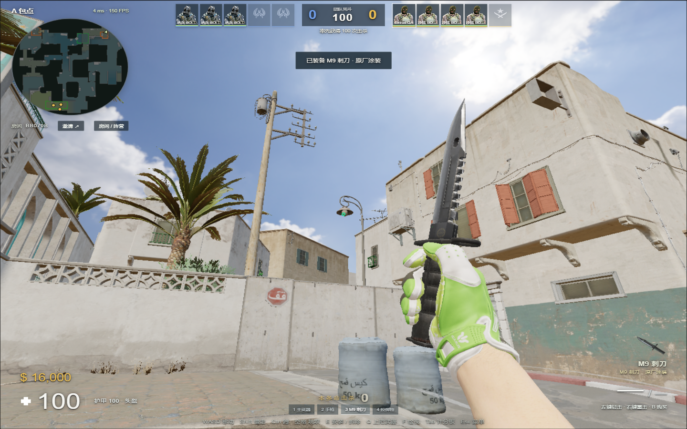

# 联机大厅、画面比例与沙二战术

2026-09-13 更新。客户端和服务器均为本项目的独立实现。

## 玩家入口

- 设置 → 画面：16:9 / 4:3，黑边 / 拉伸。相机使用所选比例计算视野，HUD、准星、瞄准镜跟随同一画布；鼠标角度不乘拉伸倍数。最低画质限制渲染像素预算，亮度设置保留。
- 装备 → 刀：新增 M9 刺刀、蝴蝶刀，原厂涂装，使用各自原版骨骼动作。先下载模型与动作，再装备。原默认爪子刀蓝宝石不变。原厂刀没有皮肤市场的磨损等级，不标成虚构的崭新涂装。
- 设置 → 声音 / 音乐盒：新增 Blitz Kids《有为青年》、Neck Deep《躺平青年》、ISOxo《非人类》。各有开局、胜负、MVP、死亡和炸弹事件片段；需下载后装备。默认《人生何处不青山》不变。
- 大厅导航 → 联机大厅：展示当前有人类玩家的房间、模式、比分、真人与机器人数；加入现有房间自动替换人机。满员/已结束的房间不可加入。最后一个真人离开后立即释放房间；浏览列表不创建模拟房间，后台标签页不轮询。
- B 商店：本回合购买区购买、尚未开火、未丢弃的枪械可退还；拾取的枪、上回合武器不可退款。CT 拆弹器继续提供购买与地面拾取。
- 走近枪械时，对应武器槽为空则自动拾取，保留弹量和皮肤，不打断手中换弹、开镜或道具。刚丢出的自己的武器有拾取保护时间。E 继续用于主动换枪。
- 爆破回合结束后存活角色可继续移动，进入下一回合购买冻结时停止；整场比赛结束仍展示结算。

## 跳投与人机

投掷松手消息携带移动指令编号与跳跃编号。服务器等待对应的移动/起跳模拟完成，再用服务器位置和速度投掷，拒绝使用客户端提交的任意速度。沿用左右键三档力度、球体扫掠、表面法线反弹与移动速度继承。

T 使用 A 大/A 小分路或 B 洞/中路夹 B，持包真人进入明确路线后队友随之调整。CT 给机器人分配两点防守、中路与 A 小职责；队友看到的敌情只保留六秒用于支援。下包后 T 分散守点，CT 选择一名拆弹手，其余掩护，真人正在拆弹时优先掩护真人。加入队友间距与避火移动。投掷使用与真人相同的准备、松手、库存和物理系统；瞄准速度、反应延迟、散布参数保持原设置。

这是规则式战术机器人，不是经过训练的职业选手 AI。本页归档最初版本；后续已将低抛估算替换成固定候选投点与真实物理预演，并修复可见部位和瞄准位置不一致的问题，见[人机重做](BOT-TACTICS-REWORK.md)。

## 本地保存与资源占用

小型设置即时保存并保留镜像；存储被禁用或写满时不抛异常中断游戏。损坏的设置 JSON 可以回退镜像。「本地资源」增加设置备份导出/恢复，包含画面、准星、按键和装备选择。上次房间仍有玩家时，大厅显示重加入入口。浏览器清除全部站点数据仍需从导出的备份恢复；房间战绩不伪装成本地可改的存档。

基础下载并发降为 2；服务工作线程接管缓存时不再保留整套额外 Blob URL。音效按需解码，两个解码任务并发，PCM 缓存控制在 32 MiB / 80 个片段内，活动声音另有现有的数量上限。新增刀型的解码模型参与有上限的回收；默认共用资源不被误释放。后台标签页停止渲染，保留联机心跳。首次加载后仍可能有着色器编译开销。

## 依据与验证

- [Valve 官方更新合集](https://store.steampowered.com/news/posts/?appids=730&enddate=1710391697&feed=steam_community_announcements)：购买菜单退还、双键中投及相关交互修复。
- [v1dma 的 Dust2 中路控制课程](https://cs2pulse.com/how-to-take-mid-control-on-dust-2-as-t/)：中路信息、道具掩护和分路进点；据此设计本项目的规则式路线，并非移植课程代码。
- 新模型、原始动作与音频来自用户本机 CS2 安装包的只读导出；资源 SHA、大小和来源路径记录在资产锁与导出脚本。Valve 与音乐作者保留原素材权利。

自动验证覆盖比例投影、设置恢复、退枪防重复与限制、空槽拾取、回合移动、松手先到的跳投时序、战术分工，以及真实 WebSocket 大厅/空房释放。实机截图为本地受控 QA，未经修改。完整结果记录在 `docs/validation/extras-20260913.json`。

216 项测试通过。180 秒、9 名人机的本机模拟产生 36 次投掷、3 次下包和 1 次拆包，服务端 tick P95 约 2.08 ms。长时间实机死亡/重生后，再进行 20 次整组替换（共 120 个机器人实例），GPU 几何体 1928 → 1927、纹理 600 → 600；初次增长与地图首次进入视野有关。未复现浏览器进程退出，不能据此保证所有电脑都不会退出。

已发布到 https://cs2.duskrain.cn/ ，线上版本 `20260912T180419Z`。21 项公网验证通过；33 个新增模型/动作/预览/音频文件的线上大小及 SHA-256 一致。Windows 便携包也已更新并通过离线与公网大厅加入验证。
