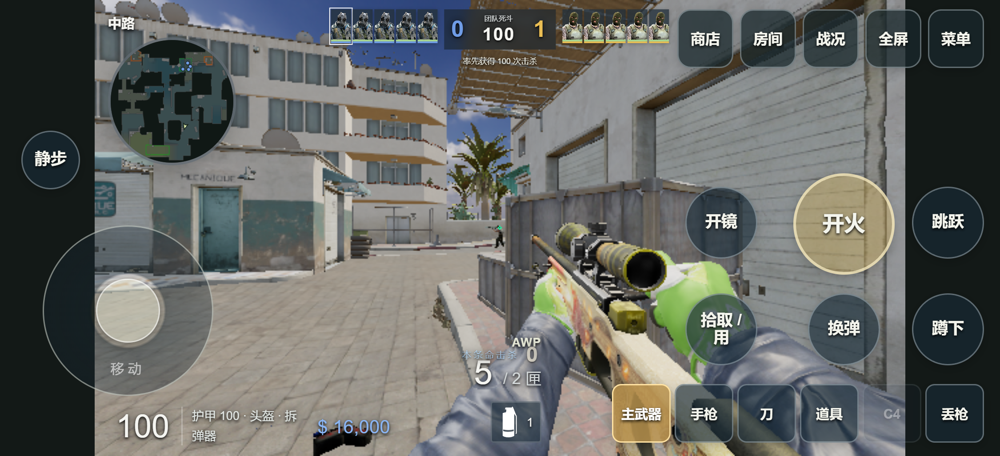
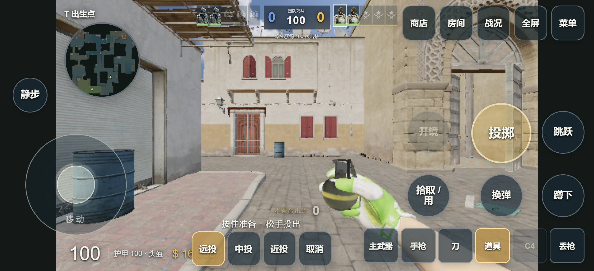
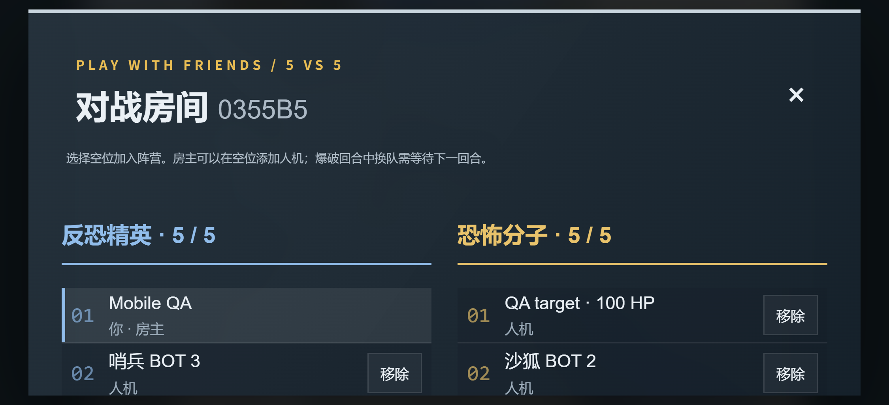

# 手机触屏与人机协作更新

2026-09-13。面向“真人所在队经常轻松碾压人机”的反馈，先补齐机器人协作和交火行为，再小幅调整枪法。双方使用同一套参数。

## 人机在对局里会怎样变化

- CT 的 B 点、A 点、A 小、中路、机动分工在回合内保持稳定，队友死亡不会让其他人重新编号、集体换位置。
- 队友实际发现敌人后，附近一名空闲机器人去补枪位置；持包者和已经交火的人继续自己的任务。信息过期后回到原有路线，守点者只在本包点附近支援。
- 交火间隙短距离横移，再减速开枪。横移前检查脚下地面和侧面障碍；低血量撤向掩体时继续执行撤退路线。
- 非紧急下包、拆包时遇到正面敌人优先交火；快要完成或时间不足时继续目标操作。
- 保留下来的主武器不重复购买。缺枪时按预算选步枪或冲锋枪，为护甲留钱。
- 初次反应等待从 420–660 ms 改为 390–610 ms，平均缩短约 7.4%；原瞄准误差乘以 0.92。伤害、转向上限和连续瞄准方式保持原有值。人机没有按比分或真人阵营获得额外属性。

此前的可见部位检查、烟雾遮挡、9 个沙二候选投点及实投前轨迹预演继续生效，见[人机重做说明](BOT-TACTICS-REWORK.md)。这些改动改善协作，不保证特定真人水平下双方胜率为 50%。

## 手机怎么玩

打开同一个[游戏网址](https://cs2.duskrain.cn/)，进入房间后点击返回游戏。触屏设备自动显示摇杆，不依赖鼠标锁定；设置 → 触屏可以手动开启或关闭。

| 区域 | 操作 |
| --- | --- |
| 左侧摇杆 | 模拟移动，轻推慢移；可同时操作其他按键 |
| 右侧空白区 / 开火按钮 | 滑动瞄准；开火按钮可边按边拖 |
| 右侧按钮 | 开火、开镜 / 重刀、跳跃、换弹、蹲伏、拾取 / 使用 |
| 下方装备栏 | 主武器、手枪、刀、道具、C4、丢枪 |
| 道具栏 | 选择远投、中投、近投；按住准备，松手投出；可同时跳跃 |
| 上方入口 | 商店、房间、按住看战况、全屏、菜单 |

蹲下和静步点按切换，拾取、下包和拆包按住使用。触屏灵敏度与按钮尺寸单独保存，也包含在本地设置备份中。切出窗口、隐藏页面、系统取消触摸、打开菜单会停止移动和开火，取消准备中的道具。修复了按钮之间转移焦点被误判为窗口失焦的问题。

建议横屏和最低画质。触屏最低画质的渲染像素预算为 921600；额外皮肤、刀和音乐盒仍按需加载。全屏和横屏锁定是浏览器可选能力，失败时仍可直接游玩。竖屏保留 16:9 / 4:3 画面比例。

以上截图来自桌面 Chrome 的移动设备模拟，未修改图像；不是手机硬件实测结果。

## 验证

- `npm test`：240 项通过，包含多指独立归属、摇杆死区与斜向限速、取消投掷、窗口与按钮失焦区别，以及人机分工、经济、支援、横移和紧急目标行为。
- `npm run build`：通过。现有主包体积警告仍在，功能验证通过。
- 本地真实服务器 + Chrome 触屏模拟：12 项多指与取消检查、7 项武器 / 道具检查、4 项菜单 / 布局检查通过。覆盖 750 × 342 横屏和 390 × 844 竖屏；设置重载后保留；浏览器未记录运行错误。
- 电脑浏览器：自动模式不显示触屏；鼠标锁定、移动、跳跃、射击、Tab、B 商店与 Esc 通过。
- 三个固定随机种子的沙二对局，各运行 240 秒，9 人机 + 1 名静止观察者。服务端 tick P95 分别为 2.02 / 1.96 / 1.93 ms；完成 41 次道具有效性与轨迹一致性验证，没有失败落点。此测试用于功能和开销检查，不能推算真人对局胜率，也不能代表生产服务器或手机性能。

复现触屏验收：先构建并启动 `node scripts/qa-stability-server.mjs`，建立 `output/playwright` 目录。用 Playwright CLI 的 Chrome `--device="iPhone 13 landscape"` 会话执行 `run-code --filename=scripts/qa-mobile-playwright.cjs`。报告在页面 `window.__mobileAcceptance`；仅使用回环 QA 端口，生产包不包含这些测试入口。

## 参考与范围

触屏输入依据 [MDN Pointer Events](https://developer.mozilla.org/en-US/docs/Web/API/Pointer_events/Using_Pointer_Events) 的独立指针和取消机制；游戏操作面使用 [touch-action](https://developer.mozilla.org/en-US/docs/Web/CSS/Reference/Properties/touch-action) 控制手势，菜单保持可滚动。[方向锁定](https://developer.mozilla.org/en-US/docs/Web/API/ScreenOrientation/lock)按可选能力处理。

尚未在实际 Android / iOS 手机完成长时间性能验收。地图、角色和纹理仍有显著内存开销，不能承诺所有手机都不会被系统终止；本次没有把桌面模拟的帧率当成手机性能数据。

## 发布验收

- 公网版本：`20260913T035105Z`，功能提交 `e6ffa47ed76bc2726ee3c41588a203c3a6e7170b`。
- HTTPS 普通联机协议 9 项检查和房间席位 5 项检查通过。生产 Nginx 配置 SHA-256 与发布前一致；回滚版本保留为 `20260913T024304Z`。
- 发布前实际房间有 1 位真人、5 位人机时，服务器 tick P95 为 4.81 ms，30 Hz 预算为 33.33 ms，进程 RSS 148 MiB。该短时采样没有显示服务器算力瓶颈；不能排除其他时刻的网络或设备问题。
- 完整服务端发布包 SHA-256：`c81e8c61cbd00dfaeecff33c68a13c59e653819f633a5e8cc3bb9456174b2e81`。
- Windows 包：`DustII-Windows-x64-20260913-035203.zip`，369625726 字节，SHA-256：`a71e487f37f629d9f185e04fb4a944425d81ca7e8315def496153c26970e2a8d`。
- 本地包清单来自干净的功能提交，2442 个文件逐项验证大小和 SHA-256、ZIP CRC 通过；包内 Node v22.23.2 成功启动离线服务器（3 人机 + 1 玩家）以及在线资源服务并连接公网。

公网 Chrome 触屏模拟实际加载全部基础资源后，自动启用摇杆、开火扣弹和跳跃通过，没有运行错误；测试房间已退出。公网 HTML、JS、CSS 的 SHA-256 与本地构建逐项相同。验收结束时服务正常，进程 RSS 125 MiB。
