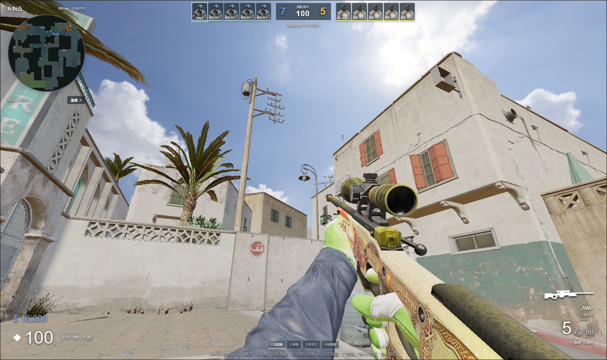

# 移动预测、边缘跳跃与晴天天空

更新于 2026-09-09。针对走路回拉、箱子边缘反复滑动和起跳落地抖动，修改了移动同步与碰撞接触处理。碰撞几何仍与 Dust II 场景对齐；这是独立网页实现，并非移植 Source 2 引擎。

## 走路为什么会抽动

旧客户端在每个服务器快照到达时，将当前位置向较早的服务器位置混合，但继续使用当前速度、跳跃状态和是否落地的判断。这几组状态属于不同时间。网络延迟下，即使持续向前走，也会周期性地往回拉。

现在每条移动指令都有编号和生命编号。客户端与服务器共同使用固定 60 Hz 的移动计算；服务器只接收方向和按键，不接收客户端提交的位置或时间步长。快照确认已经执行的指令后，客户端恢复完整物理状态，再重放尚未确认的指令。摄像机在两个模拟状态之间按显示帧率插值，避免高刷新率下重复显示固定步进位置。死亡、重生、换边和回合重定位会清空旧预测。

服务器仍按 30 Hz 调度房间、15 Hz 发送快照，每次处理有界的 60 Hz 移动指令。移动预算按实际经过的服务器时间累计，单次最多 8 步，队列最多 32 条；客户端历史最多 64 条。后者约覆盖一秒，严重停顿或超过这个范围的延迟仍可能触发可见纠正。开枪先处理到点击时的移动指令，再计算枪口位置，保留上一版的开镜方向和快速切刀行为。

设计参考 Valve 公开的[客户端预测与指令重放说明](https://developer.valvesoftware.com/w/index.php?title=Latency_Compensating_Methods_in_Client%2FServer_In-game_Protocol_Design_and_Optimization&uselang=en)和[公开移动代码](https://github.com/ValveSoftware/halflife/blob/master/pm_shared/pm_shared.c)。数值和碰撞实现不能视为 CS2 引擎的逐项复刻。

## 箱子和台阶的支撑

原先的胶囊底部在箱子边缘只有斜向接触，可能向外滑动，同时反复改变落地状态。现在采用底面平整的轴对齐碰撞箱，在地图 BVH 中求三角形接触；保留同一台阶顶面的支撑接触，避免先碰到侧面三角形后丢失落地点。

现有宽度、站立与蹲伏高度、重力、跳跃冲量和蹲跳收腿上限保持一致。这不是扩大跳跃高度。回归覆盖合成箱角、低矮顶棚、极限落台、6 处真实地图边缘，以及出生点、中路、A 大、A 小与上下层隧道的原有路线。

## 晴天天空



天空采用 Poly Haven 的 [Kloofendal 48d Partly Cloudy (Pure Sky)](https://polyhaven.com/a/kloofendal_48d_partly_cloudy_puresky)，作者 Greg Zaal / Jarod Guest，CC0。使用原始 2K HDR 全景贴图；它不是 Valve 官方资产。只作为静态背景，不增加体积云模拟，也不改变地图和武器的灯光。

文件为 5,451,493 字节，SHA-256 `5244534e9cf5b606f2ff513aa00ddb161b0a4826ffd88a0d3bd03ac29247d198`。它已纳入加载进度、资源锁定和本地缓存，下次进入可复用下载。素材来源也显示在大厅的「素材来源」中。

## 验证与边界

177 项自动回归通过，819 个运行资源文件通过 SHA-256 与尺寸检查，17 项发布包边界检查通过。新增的确定性测试覆盖单向 0 / 33 / 83 / 150 毫秒延迟及抖动、144 Hz 画面插值、错误生命编号、超量指令和射击时的位置顺序。

实际浏览器使用最低画质、1600×950、9 个静止机器人，通过回环代理给两个方向分别增加 80±20 毫秒延迟。测试包含连续走路、箱沿静止、箱沿短按跳跃和从下方跳上箱子。阶段采样记录的往返延迟约 165–244 毫秒：连续走路未测到镜头后拉，边缘站立全部保持落地；这四段检查的最大位置校正小于 0.5 毫米，跳跃后成功落台。另验 7 档开镜固定目标命中及快速切刀，均通过。这个受控场景验证移动与碰撞稳定性，不用于声称所有地图角落、所有网络或满载战斗都不会卡顿。浏览器与公网验证数据见 [movement-20260909.json](validation/movement-20260909.json)，发布信息见[稳定性记录](STABILITY.md)。

```sh
node --test --test-concurrency=1 tests/*.mjs
npm run assets:check
npm run build
python deploy/test-gameplay-overlay.py
node deploy/verify-movement-public.mjs --self-test
node deploy/verify-gameplay-public.mjs --self-test
node scripts/qa-stability-server.mjs
node scripts/qa-network-proxy.mjs
```

浏览器访问回环代理 3006，创建死斗房间，再用 Playwright CLI 执行 `scripts/playwright-movement-qa.js`、`scripts/playwright-scope-qa.js`。控制端口 3004 仅监听本机；QA 服务、代理与控制接口均不进入生产发布包。

本次修改主要解决同步和碰撞，不能据此判定此前整个浏览器关闭的问题已解决，也没有把新视角的帧率与旧视角直接比较。若仍有多人战斗卡顿，应继续区分帧时间与服务器 tick 时间；服务器空闲占用不能代表多人满载性能。

本版发布后在公网主机的独立低优先级进程测试 1 客户端、9 活动机器人、30 秒，tick p95 为 8.45–9.88 ms，单核 CPU 为 22.7%–25.9%。客户端使用旧移动协议，主要用于检查新地图碰撞对机器人逻辑的开销；新移动协议另外通过公网 WSS 步行和跳跃验收。当前无需为这次问题升级服务器，多房间同时满载仍需单独评估。
