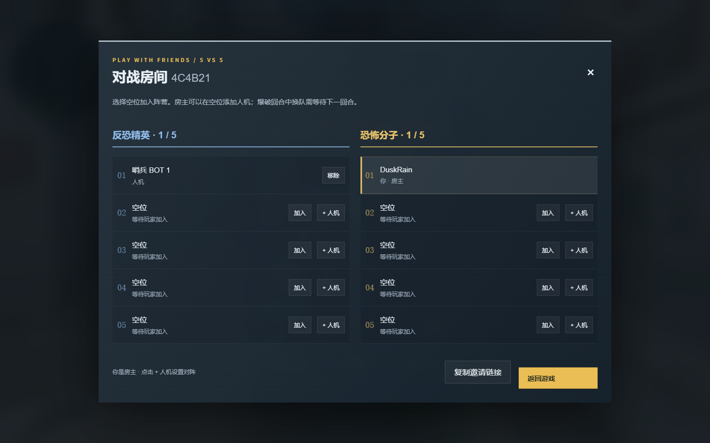
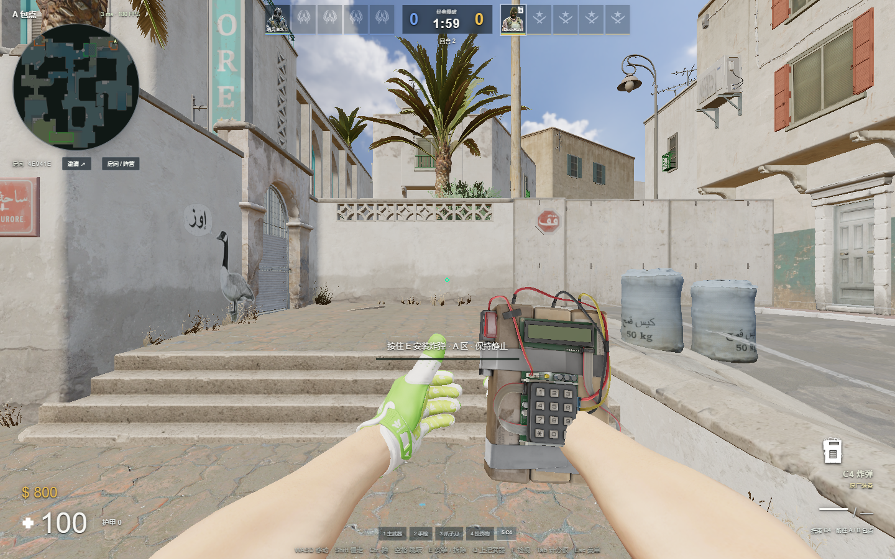
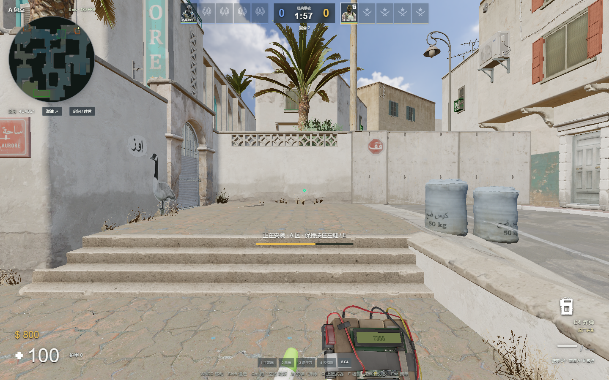
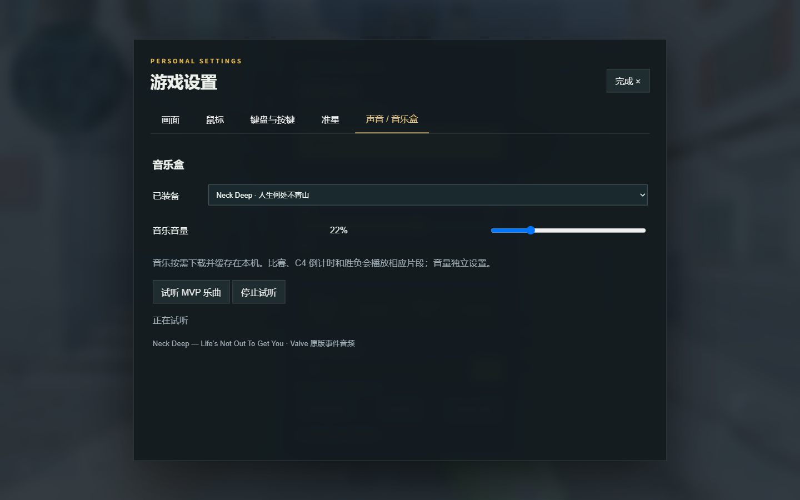

# 5 对 5 房间、换弹与 C4

2026-09-09 更新。网页实现仍是独立的 Three.js / Node.js 游戏，不是 Source 2 引擎移植。

## 朋友坐哪，人机放哪

房间固定 CT 五席、T 五席。进入房间先看到席位面板，也可以从 Esc 菜单打开「房间 / 阵营」。点击空位加入；房主可以在每个空位添加人机，也可以逐个移除。房间码和邀请链接沿用现有跨网络联机入口。

服务器检查位置是否被占用、是否为房主、每队是否超过五人。加入满房时优先替换所选队伍的人机。爆破回合中换队会等到下一回合，不能利用换队复活；换边时保留队伍身份及位置编号。房主离开后移交给下一位玩家。

## 装入弹匣后，可以切刀

空仓后继续按住左键不会强制换弹；释放左键后，有备弹就自动换弹。R 仍可主动换弹。服务器分别记录动作开始、弹药装入、攻击恢复三个时刻。

装弹时点来自本机 CS2 动作中的 `WPN_RELOAD_ADD_AMMO`，声音来自同一动作的 `CNmSoundEvent`，按本项目现有武器换弹时长缩放。提前切枪保留原弹量；装弹时点之后切刀、丢枪或拾取，已装入弹药会保留，备弹只扣一次。切回或重新拾起不能绕过攻击恢复时间。霰弹枪继续逐发装填。

23 支枪的动作声音清单与原始事件名称保存在 `shared/reload-profiles.js`。新增空仓 Glock / USP 动作，音频调度依据完整时长和已播放进度，避免收到中途快照后从退弹匣声音重播。

现有弹匣式武器保留 2026 年 CS2 的换弹弃余弹规则：[官方更新](https://www.counter-strike.net/newsentry/532126482488623360)。换枪不能提前恢复射击的处理参考 [官方修复说明](https://www.counter-strike.net/newsentry/529853754800865283)。

## C4 有模型、动作和声音

携带者按 5 取出 C4。在包点落地并保持静止，按住左键安放；E 快捷安放继续可用。松手、移动或切换装备中断进度。C4 安放后从装备栏移除；持有 C4 时 G 丢下，其他 T 可以拾取。键盘操作可自定义。

模型来自已安装 CS2 的 `weapons/models/c4/weapon_c4.vmdl_c`，保留原骨骼、贴图和取出、待机、检视、安放动作。LCD 在原模型屏幕表面显示输入及倒计时。世界掉落也使用该模型；屏幕显示、世界闪灯和爆炸闪光由网页实现。

新增原版取出、按键、安放、拆弹开始和完成、滴声、末十秒提示、近处爆炸与碎片声音，以及安装、拆除和双方获胜播报。

## 人生何处不青山

默认音乐盒为 **Neck Deep — Life’s Not Out To Get You（人生何处不青山）**，也可选择 Valve 的 Counter-Strike 2 音乐盒，或关闭音乐。设置 → 声音 / 音乐盒可以选择、调节独立音量、试听 MVP 片段。

使用已安装游戏中 `sounds/music/neckdeep_01/` 和 `sounds/music/valve_cs2_01/` 的事件片段。回合开局、死亡、胜负、MVP、C4 安装及末十秒分别触发。当前是本机选择的音乐盒，未实现向整房间广播每位玩家各自的音乐盒。

音乐在触发时按需下载并校验哈希，持久缓存；不进入基础预下载。一个 HTML 音频解码器负责音乐，内存最多保存三个压缩片段，避免把数分钟歌曲全部解码为常驻音频缓冲。游戏音效解码并发限制为四个，音效声部继续限制为 64 个。

## 验证

- 186 项全量测试通过；之后的 9 项专项回归还验证了丢枪再拾取不能绕过换弹攻击恢复时间，以及没有枪械时安放后自动回到刀。
- 实际双 WebSocket 客户端验证逐席添加人机、选队、同步及非房主拒绝。
- Chrome 实际鼠标操作验证：AK 打空后按住 450 ms，仍为 0 发且未换弹；松手自动换弹；在动作剩余约 1.29 秒时已装入 30 发，切刀再切回保留 30 / 60，攻击恢复锁仍约 1.13 秒。
- 实际浏览器验证 C4 取出、长按安放、进度、模型屏幕、自动换回武器、音乐试听和回合事件。页面无 JavaScript 错误；GPU 驱动有既存的着色器浮点精度警告。
- 席位面板在 390 px 宽度无横向溢出。游戏仍面向桌面键鼠浏览器。
- 972 个资源文件逐一核验大小与 SHA-256；877 个基础缓存文件约 198 MiB。

操作记录见 [浏览器验证数据](validation/reload-c4-room-20260909.json)。本页功能截图为本地测试服务器中的真实浏览器画面，没有图像编辑。另已通过公开网址实际创建房间、添加 / 删除人机、换至 CT 第五席后正常退出，见[线上房间实拍](screenshots/public-room-5v5.png)。

资源归属：Valve 游戏模型、动作、声音和音乐艺术家的权利保留。本仓库保留提取/转换脚本、事件资料与校验清单，二进制资源未纳入 Git。
