# DUST II · 游戏实拍

网页里的装备、探员与战场，按版本记录。原图来源、尺寸与 SHA-256 见[截图清单](screenshots/manifest.json)；验证范围与公网迁移状态见[稳定性说明](STABILITY.md)。

[新主地址](https://cs2.duskrain.cn/) · [返回项目介绍](../README.md)

## 移动与晴天天空 · 2026-09-09

晴天云层与沙城屋顶保持自然的远近层次；这是最低画质下的真实浏览器画面。天空采用 Poly Haven CC0 全景，来源与移动、跳跃验证见[更新记录](MOVEMENT-AND-SKY.md)。

## 开镜与命中修正 · 2026-09-09

AWP、SSG 08、SCAR-20 的两档视野重新校准，开枪方向与屏幕准星共用同一组数据。SG 553 接入原始举镜和开镜射击动作，镜片能清楚看到前方目标。下图来自固定目标的本地验收；性能数据、参数来源与复现方式见[修正说明](SCOPES-AND-PERFORMANCE.md)。

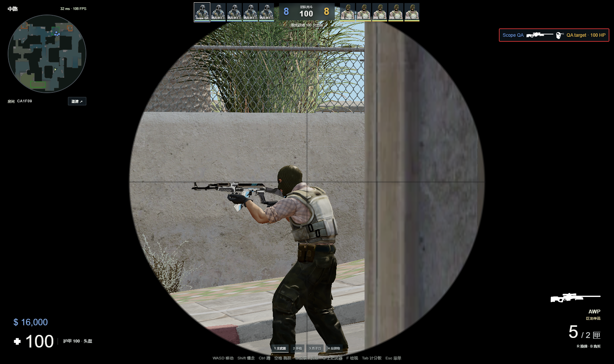

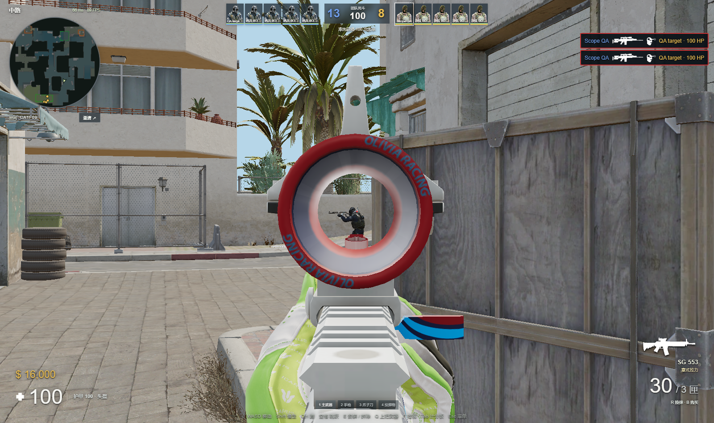

## 对局系统更新 · 2026-09-09

这一版把房间、投掷和比赛结束接成完整流程：玩家指定机器人数量，爆破按 13 胜与 MR3 加时结算，死亡继续观战，换边后探员与手臂一起改变。下列画面来自真实网页和本地服务器；换边与终局由专用本地测试夹具触发，不能视为公开匹配成绩。

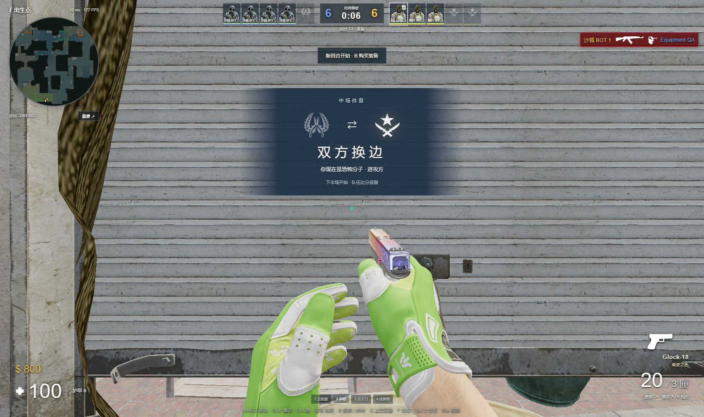

第 12 回合结束，队伍积分保留，双方交换攻守。标志来自 Valve 原始 SVG，过渡由网页 CSS 重现。

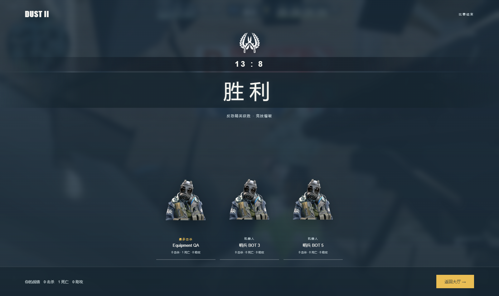

胜败按从开局保持不变的队伍身份判断。结束后显示比分和本场队员，恢复鼠标，可直接返回大厅。

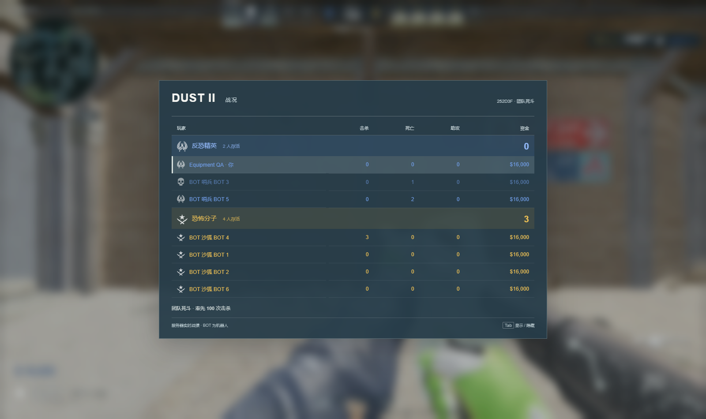

原版装备与击杀图标配合 CT / T 阵营色；长按 Tab 保持计分板，松开关闭，避免浏览器焦点跳走。

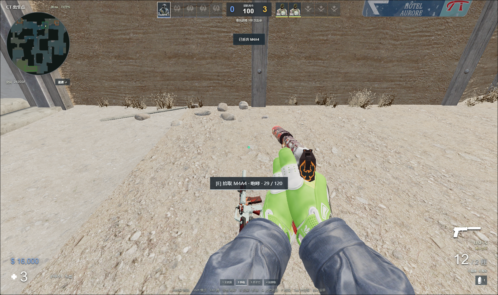

按 G 把枪留在地面，靠近并瞄准后按 E 拾取。原皮肤、弹匣和备用弹药随武器保留；捡敌方武器同样生效。

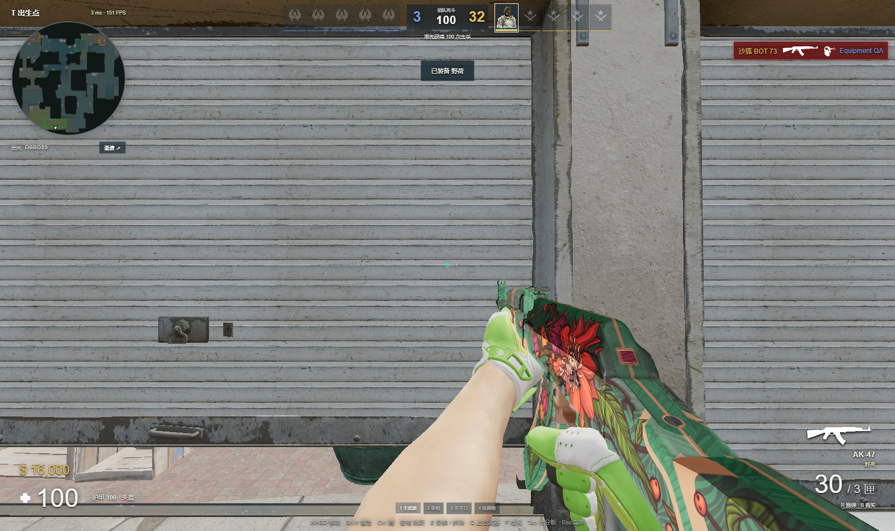

野荷的绿色底漆和花纹恢复清楚的层次，第一人称光照与沙城环境一致。T 的裸臂与树篱迷宫手套同时出现在实际战场中。

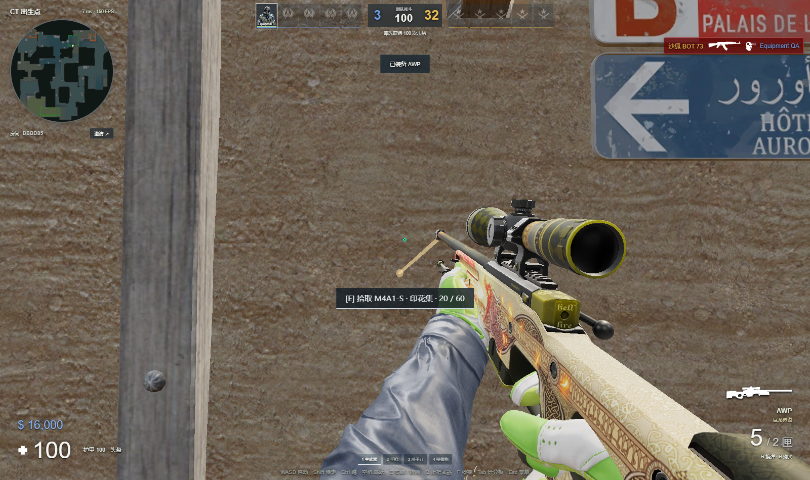

曳光从持枪枪口出发，终点由服务器的命中判定提供。AWP 每次射击显示，其他枪按原始资源中的频率处理。

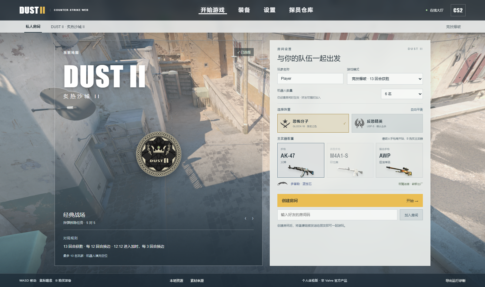

这张图直接来自新主地址。创建者选择模式、阵营与机器人数量，随后分享房间链接邀请朋友。

本次 159 项自动回归通过；8 机器人连续浏览器测试运行约 204 秒，经历 29 次死亡。公网双客户端的 8 项检查与 90 个更新文件的哈希校验通过。长时间稳定性的结论边界见[稳定性说明](STABILITY.md)。

## 装备扩展与迁移 · 2026-09-09

本次增加 23 支枪械与爪子刀、37 款武器外观、四名可选探员，以及护甲、拆弹器和三类投掷物。默认画质最低，亮度可以调节。以下按七个实际使用场景展示本次界面；新主地址已另外完成实际浏览器和双客户端联机验收，下面保留用于检查各功能的本地实拍。

### 01 / CT 的整备时间

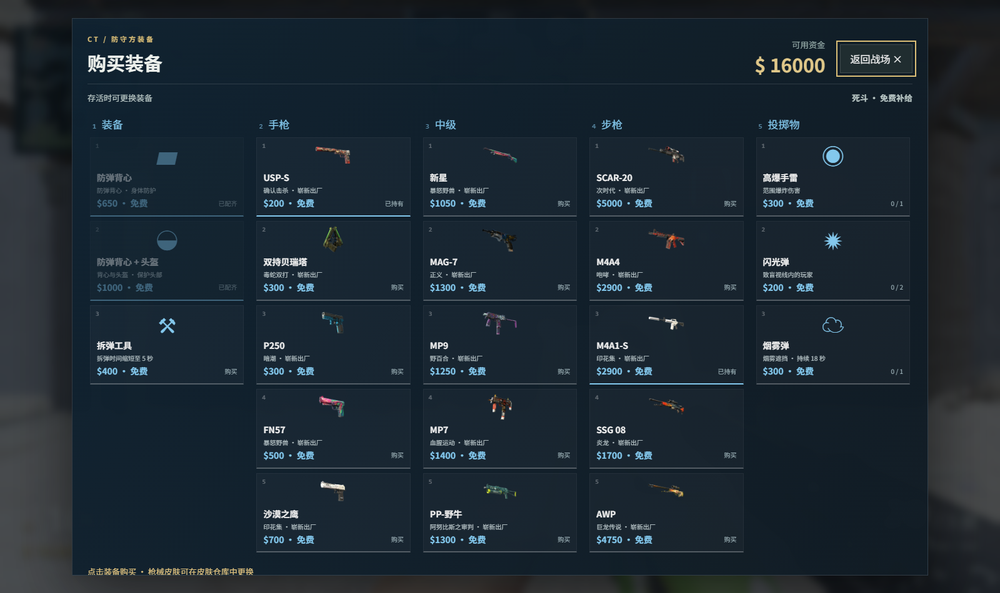

起始手枪、其他手枪、中级、步枪与装备集中在同一面板。CT 携带清单覆盖 USP-S、M4A4、M4A1-S、SCAR-20 等 15 支枪，拆弹器可把拆弹时间从 10 秒缩短至 5 秒。卡片列出目录价格，死斗免费补给，爆破按资金购买。

### 02 / T 的进攻选择

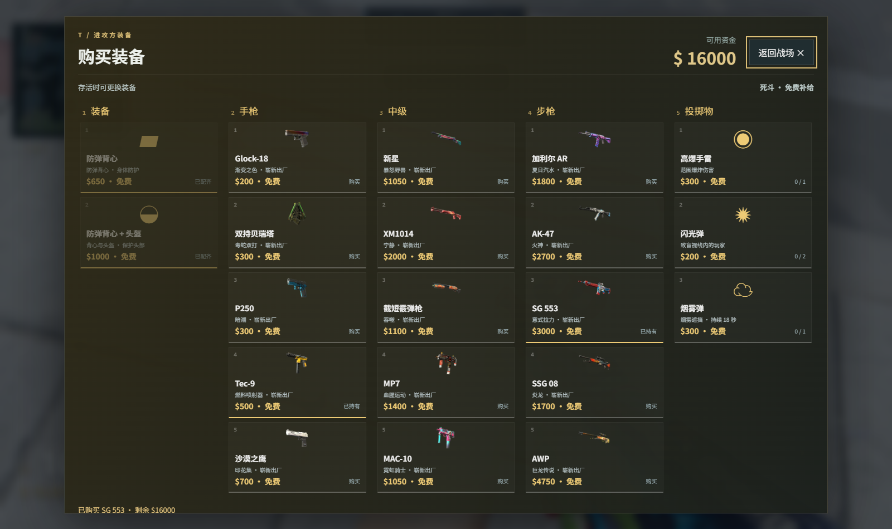

换到 T 阵营，面板随之切换为 Glock-18、Tec-9、AK-47、加利尔 AR 等携带清单。共享武器保留相同规则，服务器检查每次购买的阵营、资金与模式条件。

### 03 / 巨龙传说与树篱迷宫

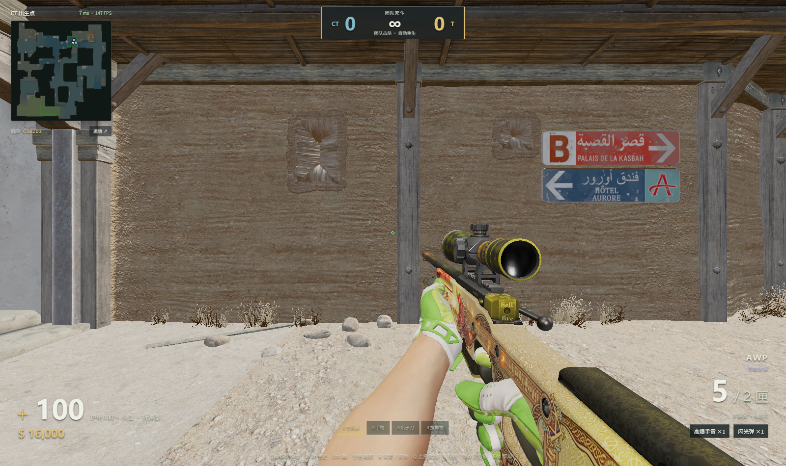

AWP 默认换为巨龙传说；双方默认佩戴运动手套「树篱迷宫」，磨损取其允许的最低值 **0.060，崭新出厂**。原模型、图案和材质参数经网页 PBR 烘焙呈现，附加磨损为 0。开镜支持 40° / 10° 两档基准水平 FOV。

### 04 / 两个阵营，分别选探员

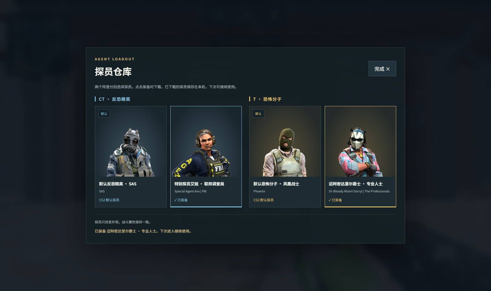

CT 默认 SAS，可另选特别探员艾娃；T 默认凤凰战士，可另选迈阿密达里尔爵士。可选探员需要时才下载，选择保存在当前浏览器，真实角色模型同步到对局。所有探员使用相同战斗属性与命中规则。

### 05 / 阵亡，镜头留在战场

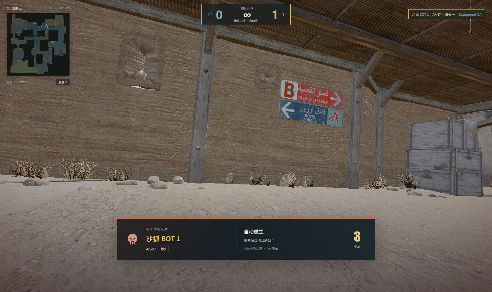

击杀信息与等待状态留在战场之上。死斗到时自动重生，爆破可以跟随存活队友；死亡不会自动跳回菜单要求再次点击「继续游戏」。Esc 仍能主动打开菜单和恢复鼠标。

### 06 / 先封烟，再移动

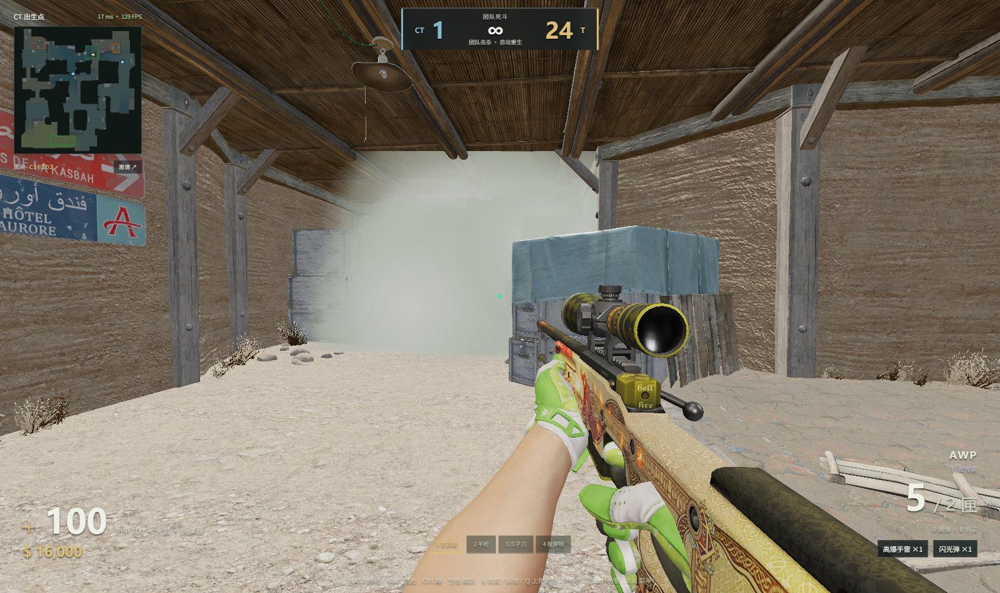

烟雾持续 18 秒，服务器用球形区域阻挡机器人视线，网页以有限云片和进入烟雾时的屏幕遮罩呈现。它与高爆、闪光组成当前三类道具原型；没有 Source 2 的响应式体积烟雾或子弹吹散效果。

### 07 / 画质和亮度，自己调整

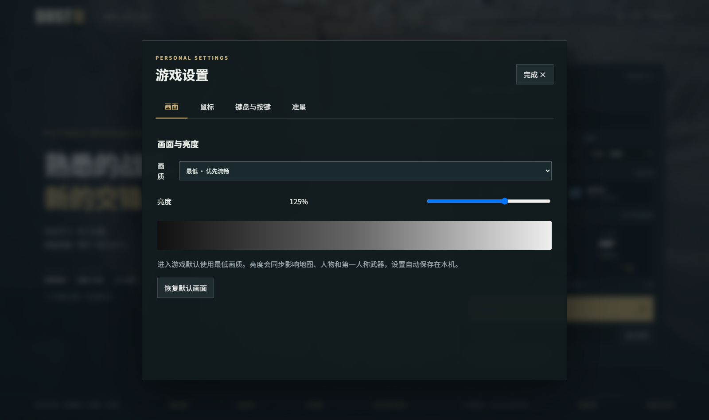

从最低画质开始，按设备能力调整；亮度可在 **60%–160%** 之间设置。鼠标只在控制对局时锁定，设置面板中保持可见。

最终客户端短测运行约 152 秒，记录 77 次采样与 21 次新增死亡；137 项自动检查和 23 支枪的实际购买、射击检查通过。这一结果不等同于长时间游玩保证，也没有把用户报告的整个浏览器关闭问题标记为已经消除。

## 上一版实拍归档 · 2026-09-08

以下 8 张图来自上一版的浏览器运行与验收。图片保留原始 PNG，未裁切、调色、合成或生成；当天不同构建阶段的界面、默认皮肤与资源数量可能与当前版本不同。

### 01 / 沙城，第一视角

熟悉的街道向中路延伸，武器握在真正的手臂模型中。这张图展示地图、第一人称骨骼、皮肤、雷达与战斗 HUD 在同一帧中的实际效果。截图版本中，巨龙传说是可选皮肤，默认 AWP 为永恒之枪；本次更新已将巨龙传说设为默认。

来源：`output/playwright/awp-dragon-live.png`。实时 3D 对局画面，原始尺寸 2560 × 1273。

### 02 / 枪响之后，结果明确

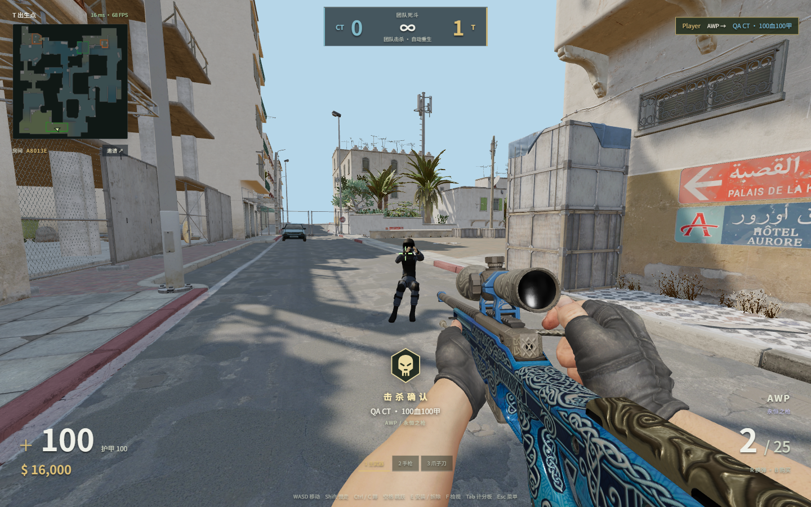

命中、扣血、击杀，由服务器确认后再呈现到屏幕。中央击杀徽章、右上角击杀信息与顶部比分共同反馈这一枪的结果。

这是一张**本地联机验证房间**截图，对手为名称中注明的「QA CT · 100血100甲」测试目标。游戏执行正常开火与命中判定；图片用于展示真实击杀反馈，不包装为公开比赛战绩。它来自当天较早构建，底部操作提示可能与当前版本略有不同。

来源：`output/playwright/upgrade-confirmed-kill.png`。实时 3D 对局与服务器事件，原始尺寸 1440 × 900。

### 03 / 下一把，换一种打法

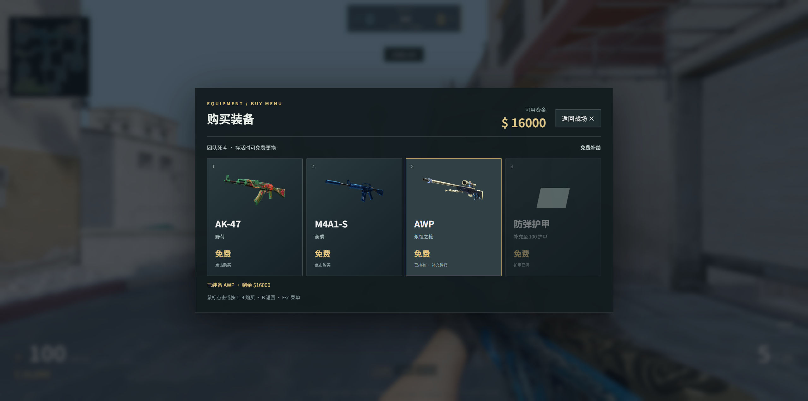

B 键打开装备商店，从步枪到 AWP，一眼看到当前武器、资金与购买结果。团队死斗提供免费补给，爆破模式则由服务器检查购买条件。

来源：`output/playwright/public-cs-shop.png`。公网游戏内商店截图，原始尺寸 2560 × 1273。装备卡片中的图片为武器库存预览图；背景来自正在运行的对局。

### 04 / 把常用装备留给自己

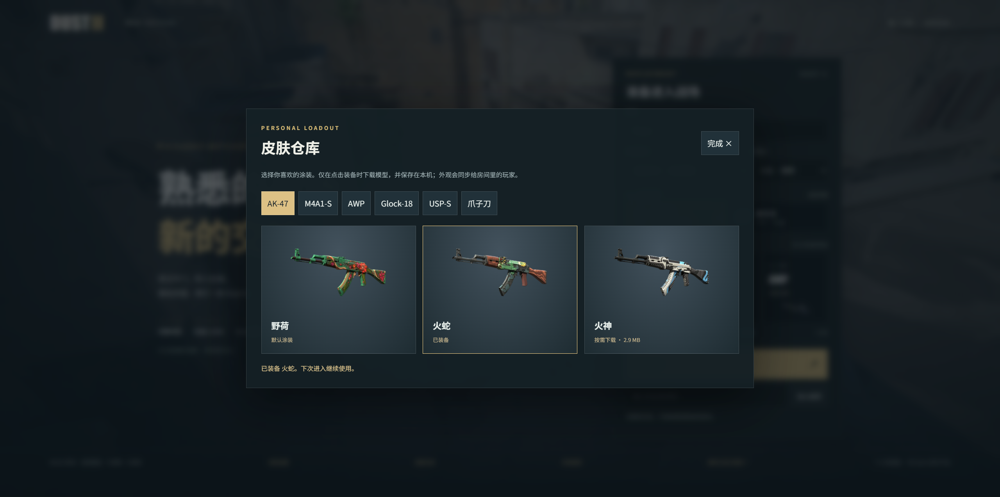

按武器浏览皮肤，查看当前装备与额外下载大小。点选喜欢的外观后才获取模型，并把选择保存在当前浏览器；进入房间时，其他玩家也能看到相应外观。

来源：`output/playwright/skin-menu-integrated.png`。运行中的皮肤仓库界面，原始尺寸 2560 × 1273。这里展示库存预览图与实际 UI，第一张实机截图展示了装备后在 3D 场景中的效果。

### 05 / 把等待留在第一次

地图、枪械、动作与声音保存在当前浏览器中，后续进入复用本地文件。更新按变化的资源补齐，额外皮肤仍然按需获取。

图中「185.0 MB / 590 个」是截图时实际保存的基础资源状态，不是所有后续版本的固定大小。PWA 提供桌面入口；离线大厅可以使用已缓存页面，对局仍需连接服务器。

来源：`output/playwright/local-cache-complete.png`。本地资源管理界面实拍，原始尺寸 2560 × 1273。

### 06 / 等待，也知道进度

加载页把过程分成下载资源、准备场景与武器、连接对战房间三个阶段。进度条呈现真实传输进度与文件数量，并保留取消及失败重试入口。

来源：`output/playwright/upgrade-public-loading.png`。公网加载界面，原始尺寸 1440 × 900；截图为当天较早版本。背景是地图展示图，这一张**不作为实时 3D 渲染效果的证据**。

### 07 / 阵亡，留在战场

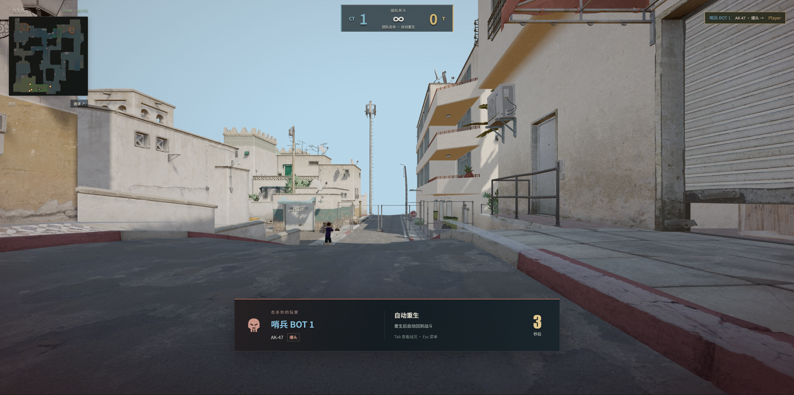

镜头留在刚才的交火位置，场景仍然可见；击杀者、武器、爆头标记和自动重生倒计时集中在底部。等待结束后，由服务器确认重生并恢复控制，玩家无需再点击「继续游戏」。

来源：`output/playwright/death-screen-qa.png`。本地联机验收房间中的阵亡画面，原始尺寸 2560 × 1273。该图用来核验死亡 UI 与自动重生流程，不代表公开匹配战绩。

### 08 / 看队友打完这一回合

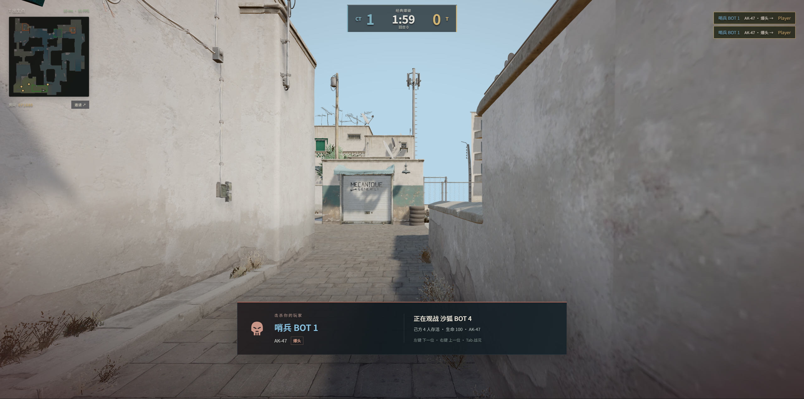

爆破回合仍在进行：阵亡后镜头跟随存活队友，面板显示对方名称、当前生命、武器以及己方存活人数。左键查看下一位，右键返回上一位；这一回合的结果仍值得等到最后。

来源：`output/playwright/spectator-screen-qa.png`。本地联机验收中的爆破存活队友观战，原始尺寸 2560 × 1273。截图时回合处于进行状态，画面中「正在观战 沙狐 BOT 4」为真实跟随目标；这是功能验收场景，不包装为竞技比赛。

死亡与观战流程参考 [Valve Spectator UI](https://blog.counter-strike.net/2012/08/4839/) 中保留队友身份、武器和生命信息的设计思路，网页界面由本项目独立实现。

## 图片与素材归属

截图记录本项目网页界面与游戏运行结果。其中可见的 Counter-Strike 地图、武器、皮肤、手套、探员及相关素材归 Valve 及相应权利人所有；早期 Quaternius 等角色素材按各自许可使用。本页面的展示不改变这些素材的权利归属，也不代表 Valve 官方作品或背书。

查看[项目说明与当前限制](../README.md#当前边界)，以及[资源获取与归属说明](ASSETS.md)。
